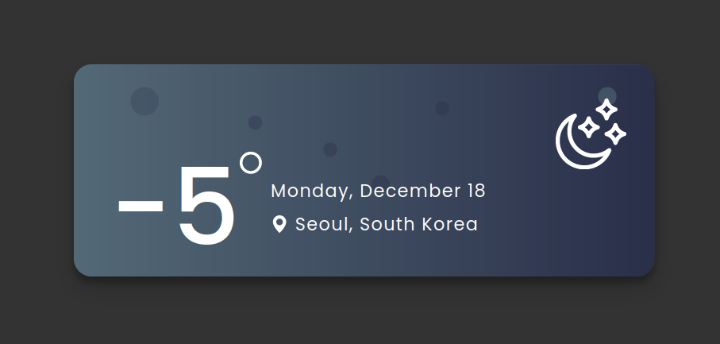

# WeatherCard

Welcome to [WeatherCard](https://dwesh163.github.io/WeatherCard/), a minimalist and user-friendly web weather application.

## Features:

-   Auto-refreshing weather map.
-   Real-time temperature display.
-   Background changes according to weather conditions.

# Easy navigation:

-   Use the left menu to switch between cities.

## Preview the site [here](https://dwesh163.github.io/WeatherCard/)

